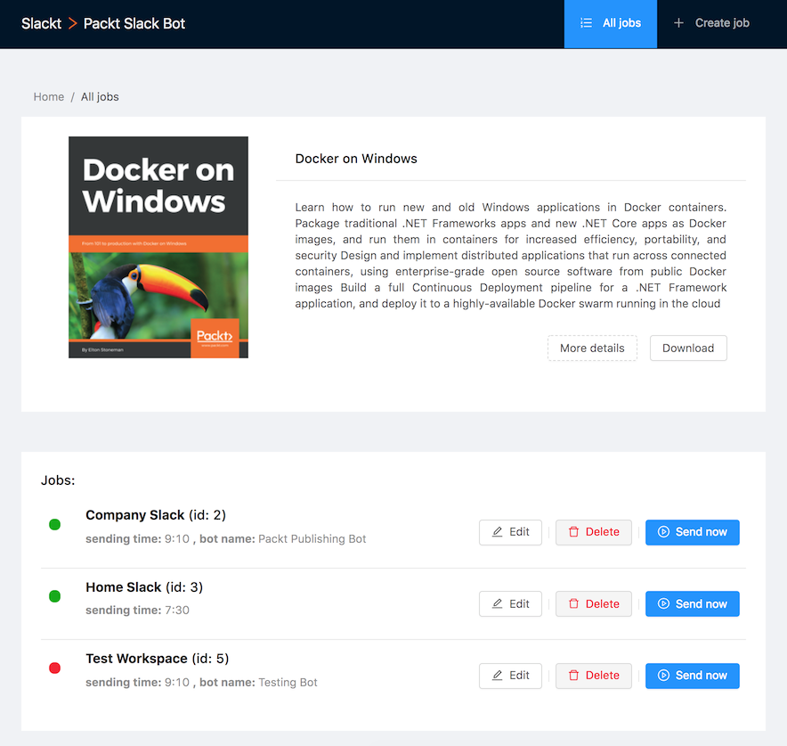
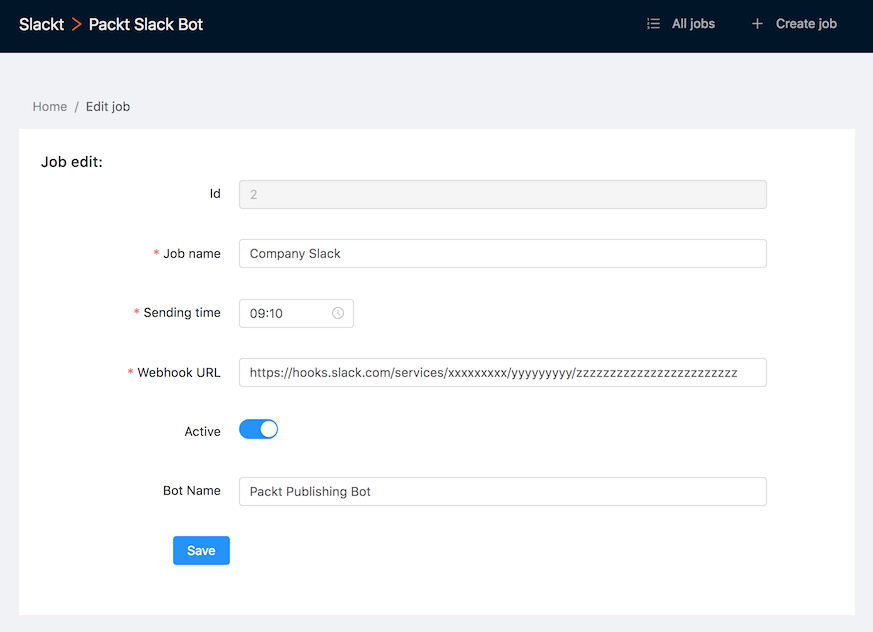
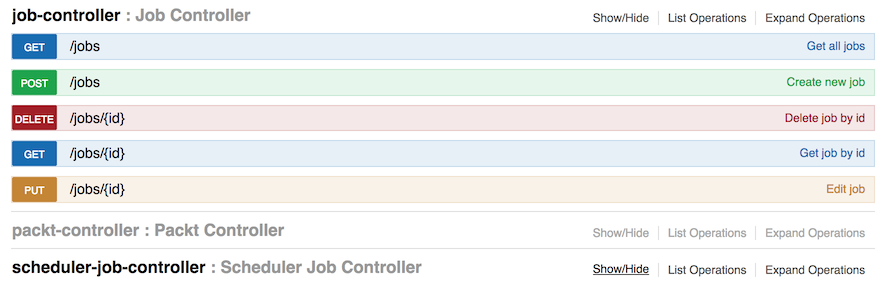

# Slackt > Packt Slack Bot

Slack bot for sending daily free random ebook from Packt Publishing.


#### Description

1. Parsing data from Packt Publishing website.
2. Mapping ebook data to Slack message format.
3. Executing POST request to Slack webhook url.
4. Multiple slack workspaces handling.






#### Stack

* Backend: Java, Spring Boot, JPA, REST, Jsoup, Lombok, Maven, Swagger, H2 DB, Quartz
* Frontend: React, Ant Design, Axios, Moment

#### Build and run Java application with embedded React (localhost:8099)

```sh
$ mvn clean install
```
```sh
$ java -jar target/ebook-0.0.1-SNAPSHOT.jar
```

#### Develop Java (localhost:8099) and React (localhost:3000):
```sh
$ mvn spring-boot:run
```
```sh
$ cd frontend && npm start
```

#### Run Java tests:
```sh
$ mvn test
```

#### Features

- [x] Configurable parameters in application.properties
- [x] ReactJs web dashboard with configurable parameters
- [x] Multiple Slack webhooks handling
- [x] Configurable cron scheduler with Quartz support
- [x] H2 single file database

#### To do

- [x] Save daily ebook to db, if exists for current day get from db instead of remote request
- [x] Enums for styles, types, colors etc.
- [x] Move cron expression to properties
- [x] Job model with CRUD for managing multiple slack workspaces/channels
- [x] Swagger UI for documenting REST API
- [x] ReactJs as UI
- [x] Frontend validation with notifications


#### Example POST request for creating new job

Example request packt ebook to slack everyday at 13:30 (1:30AM).

Create new slack job in db:
```
{
  "active": true,
  "botName": "Packt Publishing Bot",
  "channel": "#ebook",
  "createdDate": "2018-06-23T20:27:55.393Z",
  "jobName": "CompanySlack",
  "scheduler": "* 30 13 ? * * *",
  "webhook": "https://hooks.slack.com/services/xxxxxxxxx/yyyyyyyyy/zzzzzzzzzzzzzzzzzzzzzzzz"
}
```

More information in swagger (localhost:8099/swagger-ui.html):


