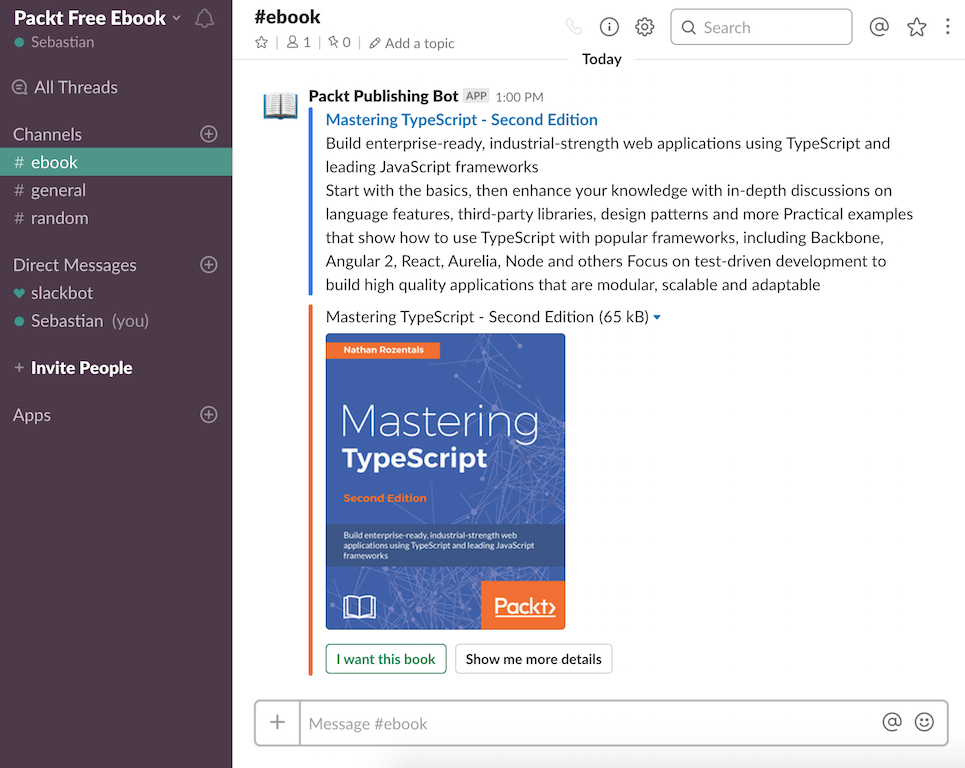

# Packt free ebook - slack bot

Slack bot for sending daily free random ebook from Packt Publishing.



#### Description

1. Getting and parsing data from Packt Publishing website.
2. Mapping ebook data to Slack message format.
3. Executing POST request to Slack webhook url.

#### Technology

* Java Spring Boot
* REST
* Jsoup / Xsoup
* Lombok
* Maven

#### Build and run

```sh
$ mvn clean install
```
```sh
$ java -jar target/ebook-0.0.1-SNAPSHOT.jar
```

#### Features

- [x] Configurable parameters in application.properties
- [ ] Create external config.properties file outside jar for dynamic parameters
- [ ] Web admin dashboard with configurable parameters
- [x] Multiple Slack webhooks handling
- [x] Configurable cron scheduler with Quartz support
- [x] H2 single file database

#### To do

- [x] Save daily ebook to db, if exists for current day get from db instead of remote request
- [x] Enums for styles, types, colors etc.
- [ ] Disable sending with null fields -> exceptions 
- [x] Move cron expression to properties
- [x] Job model with CRUD for managing multiple slack workspaces/channels
- [x] Swagger UI for documenting REST API


#### Example POST request for creating new job (quartz)

Example request packt ebook to slack everyday at 13:30 (1:30AM).

Create new Quartz scheduler job:
```
{
  "active": true,
  "jobName": "Another task",
  "scheduler": "* 30 13 ? * * *",
  "webhook": "https://hooks.slack.com/services/xxxxxxxxx/yyyyyyyyy/zzzzzzzzzzzzzzzzzzzzzzzz"
  "startDate": "2018-06-22T11:41:03.457Z",
  "endDate": "2018-06-22T11:41:03.457Z",
}
```

Create new slack job in db:
```
{
  "active": true,
  "botName": "Packt Publishing Bot",
  "channel": "#ebook",
  "createdDate": "2018-06-23T20:27:55.393Z",
  "endDate": "2018-06-23T20:27:55.393Z",
  "jobName": "Job for Example Slack",
  "scheduler": "* 30 13 ? * * *",
  "startDate": "2018-06-23T20:27:55.393Z",
  "webhook": "https://hooks.slack.com/services/xxxxxxxxx/yyyyyyyyy/zzzzzzzzzzzzzzzzzzzzzzzz"
}
```

